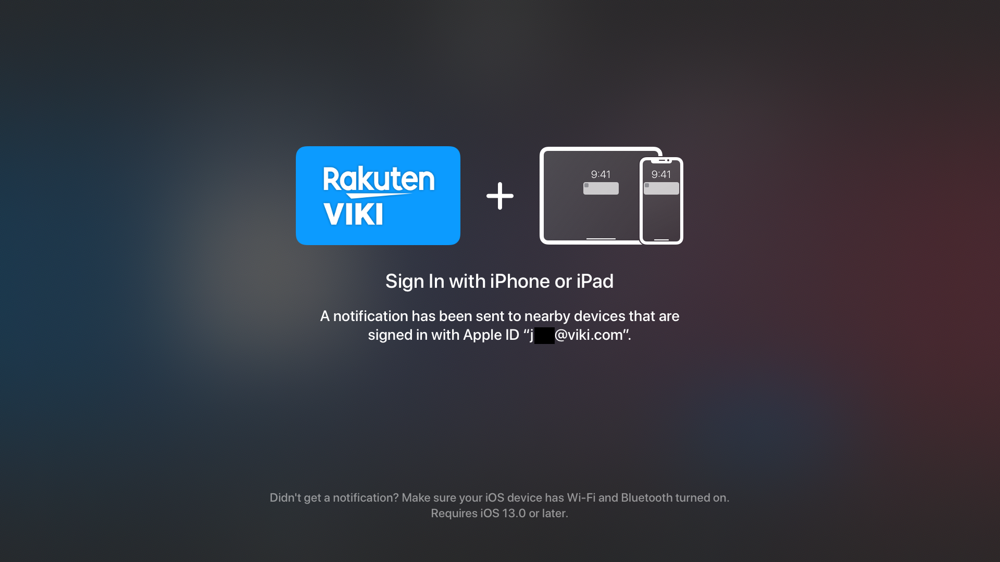

This sample project demonstrate the Apple Sign in issue. Run on an Apple TV device (Apple Sign in seems not supported on simulator), tap on Sign in with Apple and observe this UI:

then on your phone, you should see a notification:

note you may have to turn off and on bluetooth again to trigger the notification from showing. Uppon tap, observe nothing happens on mobile, user is still not logged-in on TV
